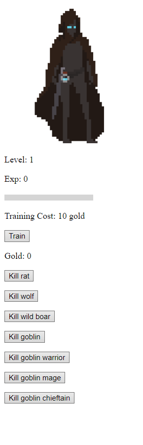
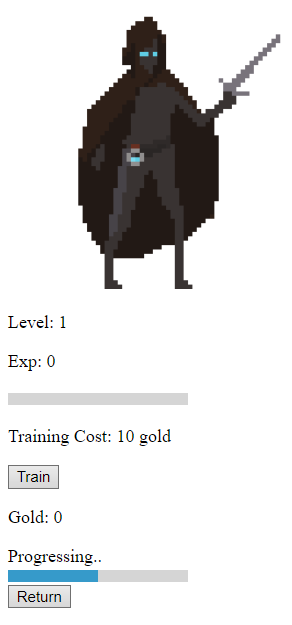

# ExplorationActivity1
## Package/Library
The program works around JavaScript's Async.js, which is a utility module. Further, the program makes use of the Promise object to work with time-related functions.
## Demonstration
The program is written and played as an RPG idle incremental game. For those who are unfamiliar with the terms, "idle" means you can leave the game in the background and it plays for you, and "incremental" means the numbers in the game just keep growing larger.
## Purpose
Initially, the program was written as a passion project, but later on expanded as a personal learning experience. It is just a game, and a game gives you enjoyment.
## Samples
The character first starts off at:
- level 1
- 0 experience
- 0 gold

To increase these parameters, you can either train your character by using gold, giving you a free level, or kill monsters to earn experience to level up. It is pretty much a typical RPG experience.
The main purpose of earning more level is killing things faster. See, each monster has a specific time needed to kill, but with a higher level you can kill them quicker, thus helping with progression.

Here are some sample screenshots of the game:
[
[
