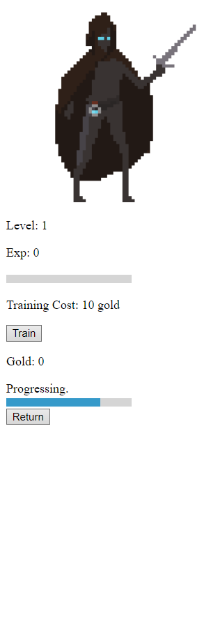

# Exploration Activity 1
## Package/Library
The program works around JavaScript's Async.js, which is a utility module. Further, the program makes use of the Promise object to work with time-related functions.

## Demonstration
The program is written and played as an RPG idle incremental game. For those who are unfamiliar with the terms, "idle" means you can leave the game in the background and it plays for you, and "incremental" means the numbers in the game just keep growing larger.

## Purpose
Initially, the program was written as a passion project, but later on expanded as a personal learning experience. It is just a game, and a game gives you enjoyment.

## Samples
The character first starts off at:
- level 1
- 0 experience
- 0 gold

To increase these parameters, you can either train your character by using gold, giving you a free level, or kill monsters to earn experience to level up. It is pretty much a typical RPG experience.
The main purpose of earning more level is killing things faster. See, each monster has a specific time needed to kill, but with a higher level you can kill them quicker, thus helping with progression.

Here are some sample screenshots of the game:

### Character portrait
Displays the character model as a .gif file. Goes into one of the 2 idle animations at random when no action is selected. When you undergo an action, the character switches to attack position .gif.

### Level
Affects the speed of performing an action by reducing the tick speed (default 1000ms) proportionally to the flat reduction of needed time. Basically, it means the higher level you have, the less time you have to wait for an action to end. Example: if the original time needed is 5s and it gets reduced to 3s, then the time delayed (or tick speed) is reduced to 60%, which is 600ms. The formula is:

                                                  tickSpeed  ×  (time-0.1×level)/time

When the result reaches 0, the action is instantaneous (it becomes a clicker game!). However, when it goes below 0, I have planned to add automation to the action with rewards based on how many seconds below 0 there are. Right now, the value is locked to 0 when it’s below 0.
Of course, the level of the character is increased when you reach a required exp value called nextLevelExp. This nextLevelExp value increases by 1.5 times and your current exp is reduced to 0 every time you level up.

### Experience (Exp)
Experience gained from performing actions. Resets when reaching next level.

### Exp bar
Displays the progress until next level.

### Training cost & Train:
Displays the cost needed to train. When the criterion is reached, clicking on the train button will increase level by 1 (but keeps the exp!) and reduces gold by the cost. Training cost increases by 2.2 times for every successful training.

### Gold
Displays current gold owned. Gold increases by performing action. Gold can be used to train the character for an increase by 1 level.

### Progress bar
Displays the progress of the action based on the time remaining.

### Return
Aborts the current action, thus not getting any rewards (gold and exp).

### Enemies/Monsters
These are mainly how you obtain gold and exp… by killing them. Each monster has their own time needed to complete its action, gold drop, exp drop. I have also planned to add level requirements before the character can kill a monster and a loot table with drop chances specific to a monster (this means an inventory system!)
